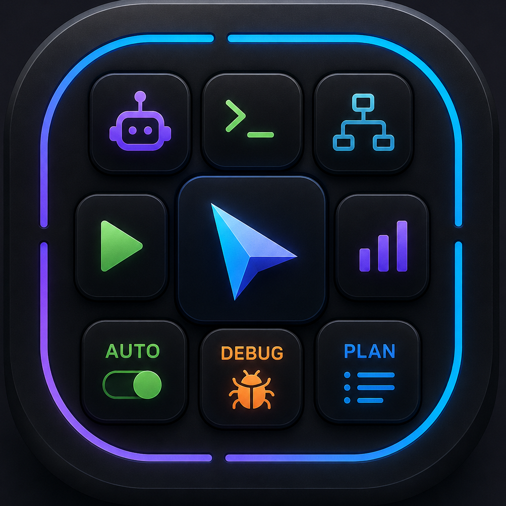

# CursorDeck

<p align="center">
  
</p>

**Stream Deck for Cursor IDE** — modes, chat, live agent status, graphs, and per-key appearance (colors, icons, motion, speed). Runs as a quiet Windows tray app; optional Elgato hardware plugin + web pad.

**Full guide (CZ):** [docs/USAGE.md](docs/USAGE.md)

## Download (Windows Setup)

1. Install [Node.js 20+ LTS](https://nodejs.org/) (required)
2. Download **`CursorDeck-Setup-*.exe`** from the latest [GitHub Release](../../releases/latest)
3. Run the Setup (no admin) → installs to `%LOCALAPPDATA%\CursorDeck`
4. Optional wizard tasks: Start with Windows, Cursor hooks, Stream Deck plugin
5. Quit Stream Deck and reopen if you installed the plugin

> Developers / from source: see Quick start below.

## Quick start (from source)

1. Install [Node.js 20+](https://nodejs.org/)
2. Clone this repo
3. Wire Cursor (keybindings + hooks):

```bat
setup.bat
```

4. Start **CursorDeck** in the system tray (no console, no browser):

```bat
start.bat
```

or double-click **`Start CursorDeck.vbs`**.

| Tray menu | Action |
|---|---|
| Open Web Pad | `http://127.0.0.1:3847/` (tabs **Pad** / **Stats**) |
| Open logs folder | `logs/` |
| Restart bridge | Restart if needed |
| Start with Windows | Toggle login autostart (HKCU Run) |
| Quit | Stop bridge + tray |

```bat
stop.bat
```

> Developer mode (console + Vite `:5173`): `start.bat --console`

## Elgato plugin

```bat
install-plugin.bat
```

1. Quit Stream Deck and reopen  
2. Enable **CursorDeck** in Preferences → Plugins if needed  
3. Keep the tray running  
4. Drag actions from category **CursorDeck**  
5. Bridge URL in Property Inspector: `http://127.0.0.1:3847`

### Customize key look

In the Stream Deck Property Inspector (action keys):

- **Immediate:** title, animation speed, phase/rotation offset, reverse, on/off  
- **Art regen:** color, Lucide icon, motion, label → PI **Aplikovat art** or `apply-appearance.bat` → Quit Stream Deck

### Multi-key graph walls (2×2 / 3×3)

Live Status + Metrics / Activity / Work Mix / Pace / Session / Health:

1. Place **4** or **9** copies of the **same** action in a square  
2. Leave Property Inspector **Layout = Auto** (default)  
3. The plugin detects the filled square and stretches one chart across the keys  

Manual 2×2/3×3 + Wall ID still available as override. Force **1×1** to disable auto-merge.

## Architecture

```text
Cursor hooks ──► bridge :3847 ◄── Stream Deck plugin
                    │
                    └── web pad (optional, same port)
```

| Package | Role |
|---|---|
| `apps/bridge` | Focus Cursor, inject chords, hooks, appearance API, web pad |
| `apps/web` | Browser pad |
| `apps/streamdeck-plugin` | Elgato plugin + Property Inspector |
| `packages/shared` | Actions, chords, appearance types |
| `hooks/` | Fail-open hook relay |
| `setup/` | Keybindings + hooks installer |
| `scripts/tray-host.ps1` | Silent tray host |

## Requirements

- Windows 10+ (key injection MVP)
- Node 20+
- Cursor IDE running
- Optional: Stream Deck 6.5+ / 7.x
- Optional: [Git for Windows](https://git-scm.com/download/win)

## Distribution (Windows Setup)

Build a classic installer (Inno Setup):

```bat
build-installer.bat
```

Output: `dist\CursorDeck-Setup-0.9.0.exe`

- Installs to `%LOCALAPPDATA%\CursorDeck` (no admin)
- Optional: Start with Windows, Cursor hooks, Stream Deck plugin, Desktop shortcut
- Requires Node.js 20+ on the target PC

If Inno Setup is missing, the bat downloads it into `tools\innosetup\` once.

## Shortcuts (after setup.bat)

| Action | Shortcut |
|---|---|
| Agent / Ask / Plan / Debug | Ctrl+Alt+Shift+1…4 |
| Cycle model | Ctrl+Alt+Shift+5 |
| New chat | Ctrl+Alt+Shift+N |
| Stop | Ctrl+Alt+Shift+Backspace |
| Accept / Reject all | Ctrl+Alt+Shift+Enter / Delete |
| Sidepanel | Ctrl+Alt+Shift+I |

Reload Cursor after setup. Re-run `setup.bat` when keybindings change.

## Bridge API (summary)

`GET /health`, `GET /state`, `GET /actions`, `POST /actions/:id`, `POST /hooks/:event`,  
`GET|PUT /appearance`, `PUT /appearance/:key`, `GET|DELETE /analytics`, `WS /ws`, static web pad on `/`.

## Verify

```bat
verify.bat
```

## Publish to GitHub

See [GITHUB.md](GITHUB.md). Contributing: [CONTRIBUTING.md](CONTRIBUTING.md).

## License

MIT — see [LICENSE](LICENSE).
